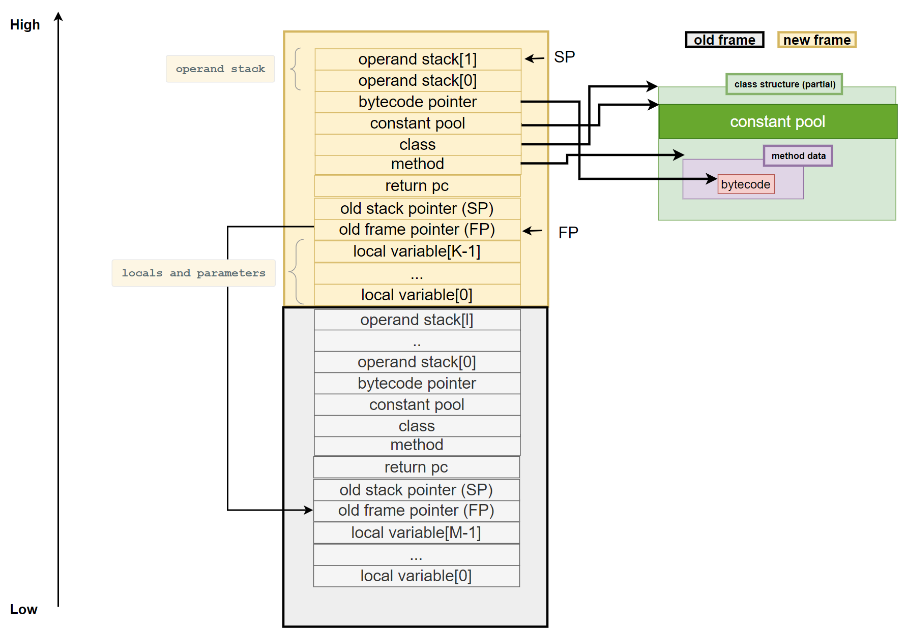

# In-Memory JVM Documentation

## Background PIM Device

## PART I. Project Structure and Files Introduction

### I.1 Project Structure

``` java
---------------------------------------------------------------------------------------------------
-- assembly
|  // current is not used. It a folder for develop JIT compiler experimentally.
-- ir
|  // intermediate language
-- utils
|
-- jdpulib
|  // java PIM framework project
-- core
|  // core src
-- 
---------------------------------------------------------------------------------------------------
```


##  II.2 Introductions of Files

1. `./rundpu.cpp`

   A c++ program that host the `dpuslave`. This may used to debug the in-memory JVM

2. `./dpuslave.c`

   Main source code of in-memory JVM

3. `./utils/jstruct_printer.c/h`

   Printer for in-memory JVM meta data structure (e.g., class, method, etc)

4. `./utils/memory_read_helper.c/h`

   Contains helper function for reading unsigned integer from **WRAM**

5. `./utils/printer_color.h`

   Contains macros for changing color in printing.

6. `./ir/bytecode.h`

   definition of bytecode

7. `./core/frame_helper.c`

   Contains method for creating a new frame, and a printer macro for printing frame

8. `./core/frame_helper.h`

   Contains macros for frame operations

9. `./core/jclass.h`

   Contains in-memory JVM Java class structure

10. `./core/memory.c`

    Contains memory space init method, and variables related to memory.

11. `./core/memory.h`

    Contains memory structure definition, macros for stack operations, etc.

12. `./core/vm_loop.h/c`

    The main part of Java interpreter.

13. `./core/vmloop_parts/xxx.inc`

    Interpretation code for each kind of Java bytecodes. 


 

   


## PART II. Compilation

``` bash
$ source <path-to-upmem-sdk>/upmem_env.sh
$ cd <path-to-dpu_jvm>
$ make dpuslave
```

+ The compilation will generate a binary file "**dpuslave**"
+ The Java framework need this binary file. This binary file can be placed to the root of framework project (`./jdpulib`).


 


## PARTIII. Components

### III.1 Frame




### III.2 Class and Method Structure


