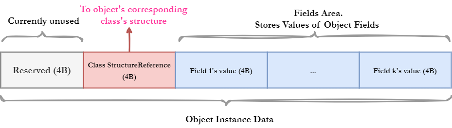
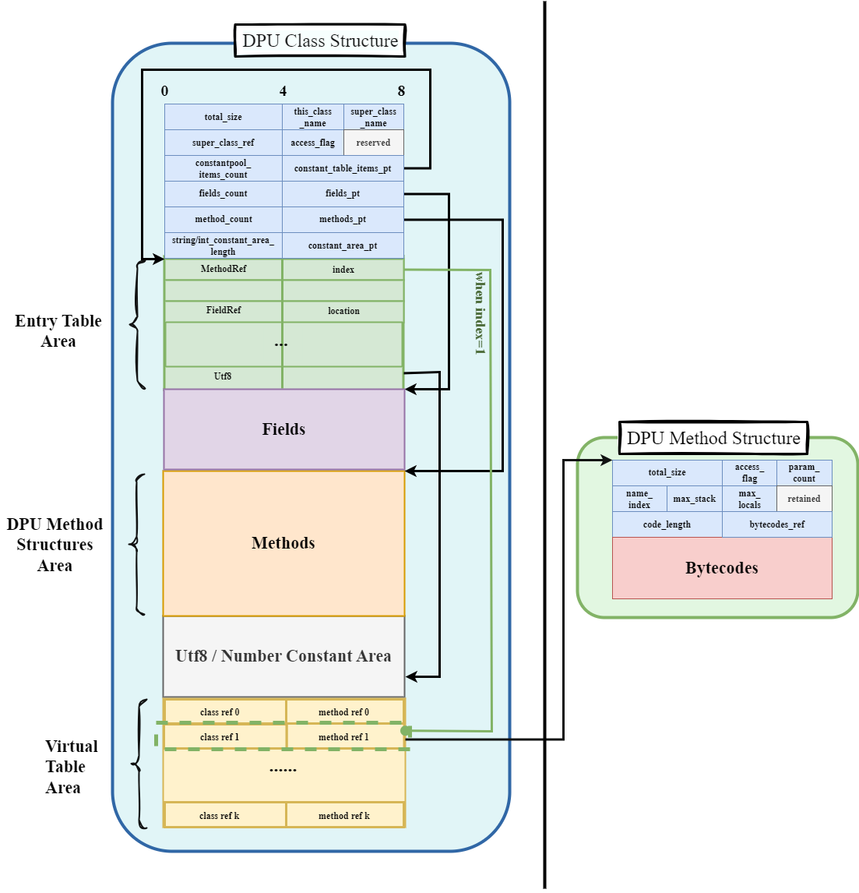

# In-Memory JVM Documentation

## Background PIM Device

## PART I. Project Structure and Files Introduction

### I.1 Project Structure

``` java
---------------------------------------------------------------------------------------------------
-- assembly
|  // current is not used. It a folder for develop JIT compiler experimentally.
-- ir
|  // intermediate language
-- utils
|
-- jdpulib
|  // java PIM framework project
-- core
|  // core src
-- 
---------------------------------------------------------------------------------------------------
```


##  I.2 Introductions of Files

1. `./rundpu.cpp`

   A c++ program that host the `dpuslave`. This may used to debug the in-memory JVM

2. `./dpuslave.c`

   Main source code of in-memory JVM

3. `./utils/jstruct_printer.c/h`

   Printer for in-memory JVM meta data structure (e.g., class, method, etc)

4. `./utils/memory_read_helper.c/h`

   Contains helper function for reading unsigned integer from **WRAM**

5. `./utils/printer_color.h`

   Contains macros for changing color in printing.

6. `./ir/bytecode.h`

   definition of bytecode

7. `./core/frame_helper.c`

   Contains method for creating a new frame, and a printer macro for printing frame

8. `./core/frame_helper.h`

   Contains macros for frame operations

9. `./core/jclass.h`

   Contains in-memory JVM Java class structure

10. `./core/memory.c`

    Contains memory space init method, and variables related to memory.

11. `./core/memory.h`

    Contains memory structure definition, macros for stack operations, etc.

12. `./core/vm_loop.h/c`

    The main part of Java interpreter.

13. `./core/vmloop_parts/xxx.inc`

    Interpretation code for each kind of Java bytecodes. 


 

   


## PART II. Compilation

``` bash
$ source <path-to-upmem-sdk>/upmem_env.sh
$ cd <path-to-dpu_jvm>
$ make dpuslave
```

+ The compilation will generate a binary file "**dpuslave**"
+ The Java framework need this binary file. This binary file can be placed to the root of framework project (`./jdpulib`).


 


## PARTIII. Components

### III.1 Frame


### III.2 Object Structure




### III.3 Class Structure



1. **total_size**: $4$-byte unsigned int value. The total size (in bytes) of the entire class structure.

2. **this_class_name**: $2$-byte unsigned short int value. An index to an `UTF-8` item in the entry table. The `UTF-8` item in the entry table indicates the offset of the string of this class's name inside the `Utf8 / Number Constant Area`.
3. **super_class_name**: $2$-byte unsigned short int value. An index to an `UTF-8` item in the entry table. The `UTF-8` item in the entry table indicates the offset of the string of the super class's name inside the `Utf8 / Number Constant Area`. 
4. **super_class_ref**: $4$-byte MRAM pointer points to the super class's class structure.
5. **access_flag**: $2$-byte `access_flag`.

> For the `access_flag`, it could refer to https://docs.oracle.com/javase/specs/jvms/se8/jvms8.pdf (page $71$) for more details.
>
> 

6. **constantpool_items_count**: The count of items in the constant table of the original Java class file. This value is equal to the count of items in the entry table of the DPU class structure. 

   > The  constant table of the original Java class file store symbol reference of various types of resources, e.g., classref, FieldRef, utf-8 string, integer value, double value, etc. 
   >
   > Each item in the constant table is resolved to a value that can be used to access the corresponding resource, and become an item in the entry table inside the DPU class structure.

7. **entry_table_items_pt**: points to the beginning of the entry table.

8. **fields_count**: count of fields defined in this class.

9. **fields_pt**:  $4$-byte MRAM pointer points to the field area of the DPU class structure

10. **method_count**: $4$-byte unsigned short integer. The count of methods in the method area of this DPU class structure.

11. **methods_pt**: $4$-byte MRAM pointer points to the method area of the DPU class structure

12. **string/int_constant_area_length**: $4$-byte unsigned short integer. It indicates the length (in bytes) of the **Utf8 / Number Constant Area**.

13. **constant_area_pt**: $4$-byte MRAM pointer points to the **Utf8 / Number Constant Area**.

14. **Entry Table**: Contains **constantpool_items_count** $8$​-byte items. 

    The constant table of the original Java class file store symbol reference of various kinds of resources, e.g., ClassRef, FieldRef, UTF-8 string, integer value, double value, etc. 

    The entry table inside a DPU class structure is a resolved constant table, with the same amount of items as the original class file's constant table.

    Each item in the constant table of original class file is resolved to $8$-byte item in the entry table in the DPU class structure.

    Each entry table item's lower $4$ bytes  store a value that can be used to access the corresponding resource.

    Each entry table item correspond to a resource. For different kind of resource, the  lower $4$ bytes of entry table item hold different meaning.

    Different type of resources' entry table items lower $4$ bytes value are interpreted as follows:

    + **MethodRef**: $4$-byte index to the virtual table
    +  **UTF-8**: $4$-byte byte offset of the **Utf8 / Number Constant Area**
    + **int/short int**: the direct value of the integer
    + **FieldRef:** $4$-byte index indicates the index of the corresponding field inside the field area of the object instance of this class.

15. **Fields**: stores field structures.

16. **Methods**: 

    Stores DPU method structures of this class. A method structure's content is shown in the right side of the figure with label "DPU Method Structure".

    This area does not include inherent methods' structures. 

17. **Virtual Table**:

The virtual table of this class. Each item is $8$-byte. The first 4 bytes of each item is a $4$-byte MRAM pointer points to a DPU class structure. The last $4$ bytes of each item is a pointer points to a DPU method structure. 

A method invocation bytecode contains an index to a MethodRef item in the entry table. The  MethodRef item in the entry table indicates an index of the virtual table. The invocation operation then utilize the class reference and method reference information provided by the virtual table item to recognize which method of which class should be invocated.


### III.4 Method Structure


1. **total_size**: $4$-byte unsigned integer. The total size of this DPU method structure in bytes.

2. **access_flag**: $2$-byte unsigned integer. The access flag of this method. For more details, refer to https://docs.oracle.com/javase/specs/jvms/se8/jvms8.pdf （Page 93)

   

3. **parameter_count**: $2$-byte unsigned short integer. The count of parameters of this method.

4. **name_index**: $2$-byte unsigned short integer. Indicates the index to a UTF-8 item inside the entry table.

5. **max_stack**: $2$-byte unsigned short integer. The max count of elements inside the evaluation stack in the process of executing this method.

6. **max_locals**: $2$-byte unsigned short integer. The max amount of local variables, includes arguments.

7. **code_length**: length of the bytecode list of this method, in bytes.

8. **bytecode_ref**: reference to the bytecode area of this method.

9. **bytecodes**: the bytecode area of this method, storing bytecodes of this method.


### III.5 Interpreter (DPU JVM)

+ `bytecode.h` inside `./ir` defines all names of JVM bytecodes

+ `dpuslave.c` define the main function of the DPU JVM. 
+ Each tasklet (hardware thread) run a DPU JVM. The amount of tasklets per DPU is defined by the macro `TASKLET_CNT`. `TASKLET_CNT` is defined by the `make` tools, and is defined in the `Makefile`.
+  All tasklets in a DPU will begin running simultaneously after a DPU is launched.

+ Each tasklet holds a task buffer independent to other tasklets.

+ Each tasklet process the task inside its task buffer serially.

+ Each task has the format as following:

  `| task_id (4B) | java class structure pointer (4B) |  java method structure pointer (4B) | parameters (4 * parameters_count * B)|`

+ Each task holds a unique `task_id`. The execution result of task with `task_id` is written to `return_values[task_id * 2]` and `return_values[task_id * 2 + 1]`, with `return_values[task_id * 2]` storing the `task_id` and `return_values[task_id * 2 + 1]` store the return value.
