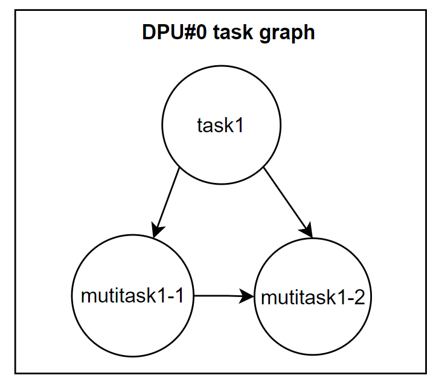
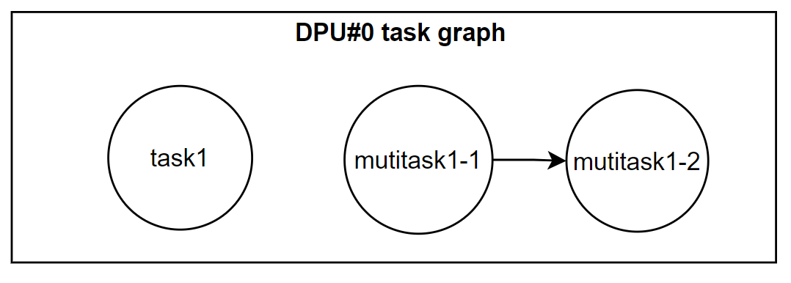
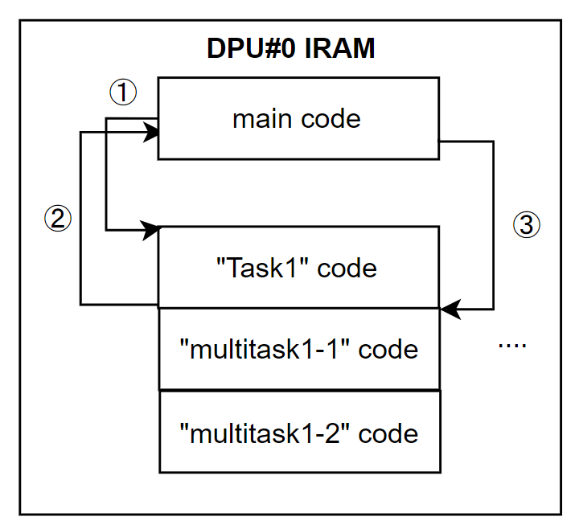

## A JIT-compiler Based Auto Task-Level Parallel Model for PIM.

> 参考になれたら幸いです。

[Draft]

> タスクとタスクの依存関係を定義出来るような仕組みを導入し、自動的並行可能なタスクを見つけて、Tasksを並行処理できるようにSchedulingをする, JITによってtaskをcompileしDPUへ実行する。


**Problems:**

+ Non-JIT -> slow
+ No task dependency definition and tasks scheduling functionality -> high-performance task-level parallel is complex.

**Goal:**

+ Multi-task definition and scheduling.
+ JIT-based execution.

**Approach**

+ Each task is represented with Java lambda expression.  
+ `PIMTaskPool` manages and schedules multiple tasks. Provide a way to define tasks and task dependency graphs.
+ Provide a scheduler for auto task-level parallelism.
+ Tasks are compiled by JIT. Subsequentially sent to DPUs.


``` java
public class Main{
    public static void main(String[] args){

        
        Object[] params1 = ...;
        Object[] params2 = ...;

        PIMTaskPool pool = new ();
        pool.appendPIMTask(0, null "task1", (..)->{..}) // append task1 to dpu#0, without predecessor
            .appendMultiPIMTask(0, "task1", "multi-task1", (..)->{..}, (..)->{..}); // connect multi-task1 to predecessor "task1", in DPU#0.
            .feedArgs(0, "task1", params1) // feed arguments to task1
            .feedArgs(0, "multi-task1", params2); // feed arguments to multi-task1
        
        Object result;
        // get result without scheduling (sequentially executed all tasks, without task-level parallelism)
        pool.execute();

        // get result with a given scheduler.
        result = pool.applyScheduler(..).execute();
    }
}


public PIMTaskPool{
    /******* Methods for append task *************/
    PIMTaskPool appendPIMTask(int dpuID, String predecessorName, String taskName, PIMTask task);

    PIMTaskPool appendMultiPIMTask(int dpuID, String predecessorName, String multiTaskName, PIMTask task1, PIMTask task2);
    PIMTaskPool appendMultiPIMTask(int dpuID, String predecessorName, String multiTaskName, PIMTask task1, PIMTask task2, PIMTask task3);
    /* ... */
    PIMTaskPool appendMultiPIMTask(int dpuID, String predecessorName, String multiTaskName, PIMTask task1, PIMTask task2, PIMTask task3, ..., PIMTask task31);


    /******* Methods for append ready tasks (a ready task is a task that all arguments for it are prepared.) *************/
    PIMTaskPool appendReadyPIMTask(int dpuID, String predecessorName, String taskName, PIMTask task, Object... params);
    PIMTaskPool appendReadyMultiPIMTask(int dpuID, String predecessorName, String multiTaskName, PIMTask task1, PIMTask task2, Object... params);
    PIMTaskPool appendReadyMultiPIMTask(int dpuID, String predecessorName, String multiTaskName, PIMTask task1, PIMTask task2, PIMTask task3, Object... params);
    /* ... */
    PIMTaskPool appendReadyMultiPIMTask(int dpuID, String predecessorName, String multiTaskName, PIMTask task1, PIMTask task2, PIMTask task3, ..., PIMTask task31, Object... params);


    PIMTaskPool feedArgs(int dpuID, String tName, Object... params);


    PIMTaskPool applyScheduler(PIMTasksScheduler scheduler){
        /* ... */
    }

    Object execute(){
        /* ... */
    }

    /* ... */

}

```

### Implementation

+ After completing the construction of a task, a task dependency (a graph that describes the execution order of tasks) graph should exist for each DPU.

  + The original graph represents the execution order of tasks in the same structure they are constructed by `apeendxxxx()`. 

    e.g. 

    

+ Implement a scheduler rewriting the task graph for each DPU, achieving task-level auto parallelism.

  + Rewrite the task graph by auto parallelism detection.  -> Make parallelizable tasks execute in parallel.
  + After rewriting, if  and **multi-task1** are parallelizable, the graph may seem like following graph
  + 

#### JIT Compilation

Tasks are compiled into binaries.




### 


==========================================

+ Each argument of a task should be a primitive or a proxy instance that the target object is in the DPU with an ID that is same as the the task's DPU ID.

+ IRAM capacity may not enough for storing all tasks. 

+ It may need some extra effort to obtain the bytecodes of lambda expression..

``` java
        DPUGarbageCollector garbageCollector = UPMEM.getInstance().getDPUManager(dpuID).garbageCollector;
        DPUClassFileManager classFileManager = UPMEM.getInstance().getDPUManager(dpuID).dpuClassFileManager;
        DPUCacheManager cacheManager = UPMEM.getInstance().getDPUManager(dpuID).classCacheManager;

        // get real class
        anomyousClass = anomyousClass.getInterfaces().length == 0 ? anomyousClass.getSuperclass() : anomyousClass.getInterfaces()[0];
        String cName = anomyousClass.getName().replace(".", "/");

        // java/lang/Object is needed
        classFileManager.loadClassToDPU(Object.class);

        // send anomynous class to JVM temporary
        DPUJClass dpuJClass = classFileManager.loadClassToDPU(anomyousClass);
	
```


